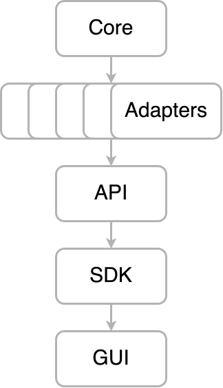

# digiLab-OS

### digiLab's framework for building and integrating uncertainty-aware AI systems.

## Architecture

## Core

| Repository                                 | Status                                                                                                                                        | Description                                                        |
| ------------------------------------------ | --------------------------------------------------------------------------------------------------------------------------------------------- | ------------------------------------------------------------------ |
| [Core](https://github.com/digiLab-OS/Core) |  | Shared interfaces, errors, validators and data models definitions. |

## Composition

| Repository                               | Status                                                                                                                                      | Description                            |
| ---------------------------------------- | ------------------------------------------------------------------------------------------------------------------------------------------- | -------------------------------------- |
| [API](https://github.com/digiLab-OS/API) |  | Adapter composition and digiLab-OS API |

## SDKs

| Adapter                                              | Status                                                                                                                                                  | Description                                                    |
| ---------------------------------------------------- | ------------------------------------------------------------------------------------------------------------------------------------------------------- | -------------------------------------------------------------- |
| [PythonSDK](https://github.com/digiLab-OS/PythonSDK) |  | Python client library for interacting with the digiLab-OS API. |

## Adapters

### Authentication

| Adapter                                                                     | Status                                                                                                                                                                                              | Description                                                                             |
| --------------------------------------------------------------------------- | --------------------------------------------------------------------------------------------------------------------------------------------------------------------------------------------------- | --------------------------------------------------------------------------------------- |
| [OIDC](https://github.com/digiLab-OS/AuthenticationAdapter-OIDC)            |            | Authentication adapter for verifying user credentials using OpenID Connect.             |
| [Local JSON](https://github.com/digiLab-OS/AuthenticationAdapter-LocalJson) |  | Authentication adapter for verifying user credentials using a local JSON configuration. |

### Authorization

| Adapter                                                                      | Status                                                                                                                                                                                              | Description                                                              |
| ---------------------------------------------------------------------------- | --------------------------------------------------------------------------------------------------------------------------------------------------------------------------------------------------- | ------------------------------------------------------------------------ |
| [Local Cedar](https://github.com/digiLab-OS/AuthorizationAdapter-LocalCedar) |  | Authorization adapter for enforcing access control policies using Cedar. |

### Ephemeral

| Adapter                                                       | Status                                                                                                                                                                            | Description                           |
| ------------------------------------------------------------- | --------------------------------------------------------------------------------------------------------------------------------------------------------------------------------- | ------------------------------------- |
| [Redis](https://github.com/digiLab-OS/EphemeralAdapter-Redis) |  | Redis-backed short-term data storage. |

### Persistence

| Adapter                                                                              | Status                                                                                                                                                                                                    | Description                              |
| ------------------------------------------------------------------------------------ | --------------------------------------------------------------------------------------------------------------------------------------------------------------------------------------------------------- | ---------------------------------------- |
| [Local Filesystem](https://github.com/digiLab-OS/PersistenceAdapter-LocalFilesystem) |  | Local filesystem long-term data storage. |

### Execution

| Adapter                                                   | Adapter Status                                                                                                                                                                | Worker Status                                                                                                                                                               | Description                                            |
| --------------------------------------------------------- | ----------------------------------------------------------------------------------------------------------------------------------------------------------------------------- | --------------------------------------------------------------------------------------------------------------------------------------------------------------------------- | ------------------------------------------------------ |
| [Ray](https://github.com/digiLab-OS/ExecutionAdapter-Ray) |  |  | Execution adapter for distributed computing using Ray. |

### Orchestration

Upcoming
